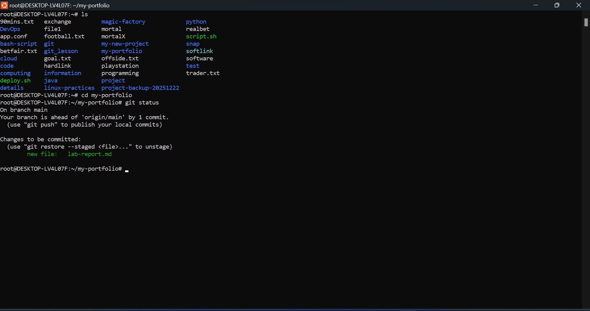
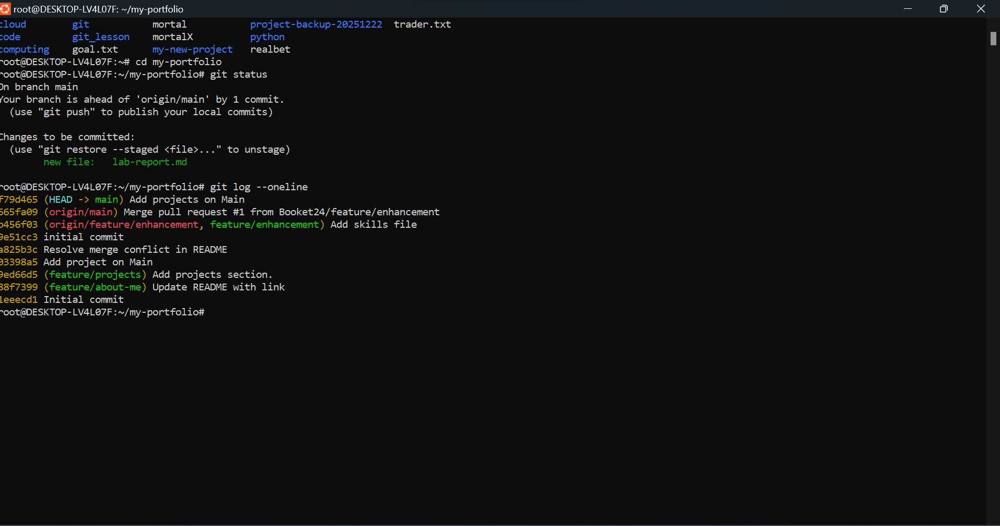
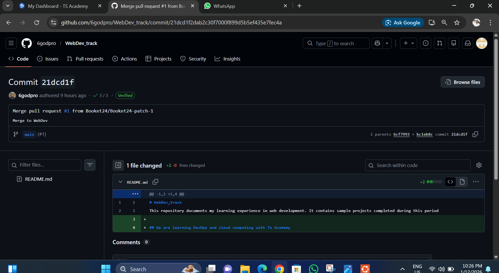

## Screenshot

### Git Status

### Git Log 

### GitHub Repository

## Reflection
**What was challenging?**  
Learning how to resolve merge conflicts and understanding when to pull before pushing was challenging at first.

**How does Git help DevOps teams?**  
Git enables collaboration, version control, rollback of changes, and supports CI/CD workflows by tracking changes across teams.

## Issues Faced & Resolutions
- Faced a merge conflict → resolved by reviewing conflicting files and committing the correct version.
- Push rejected → fixed by running `git pull` before pushing

